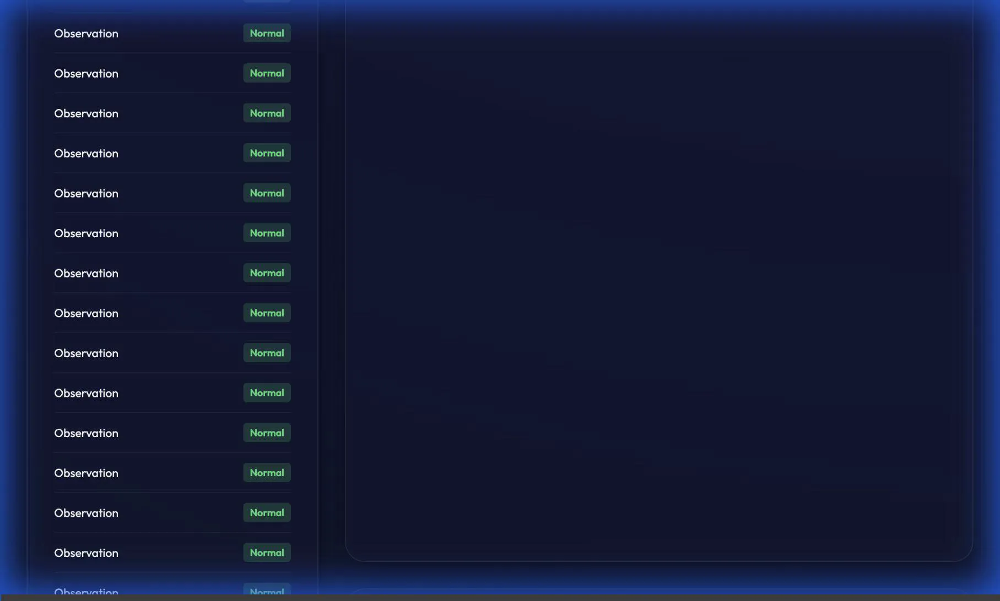
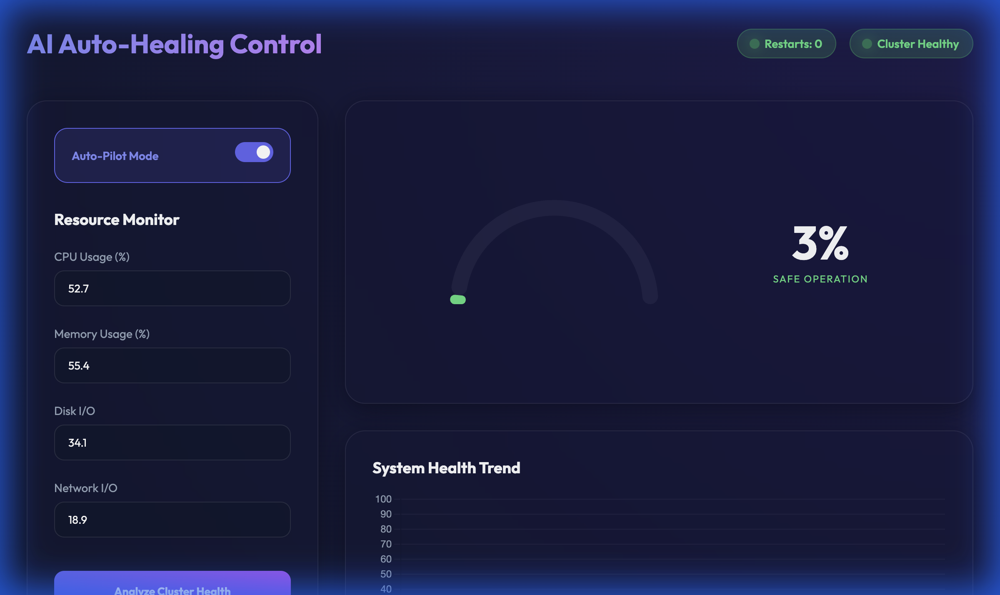
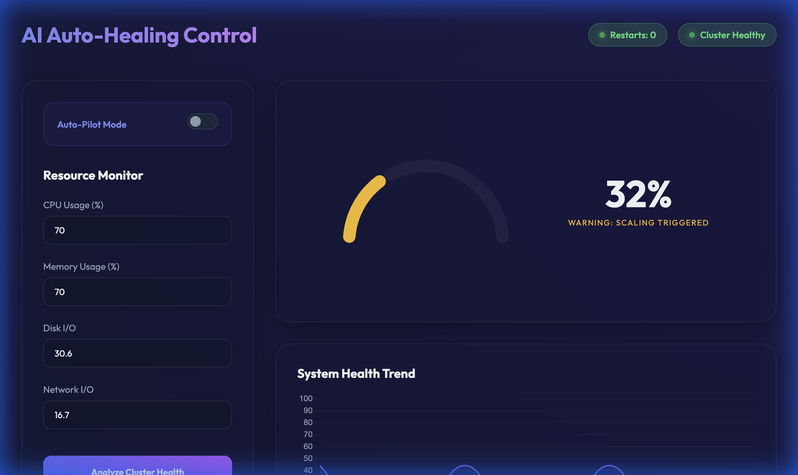
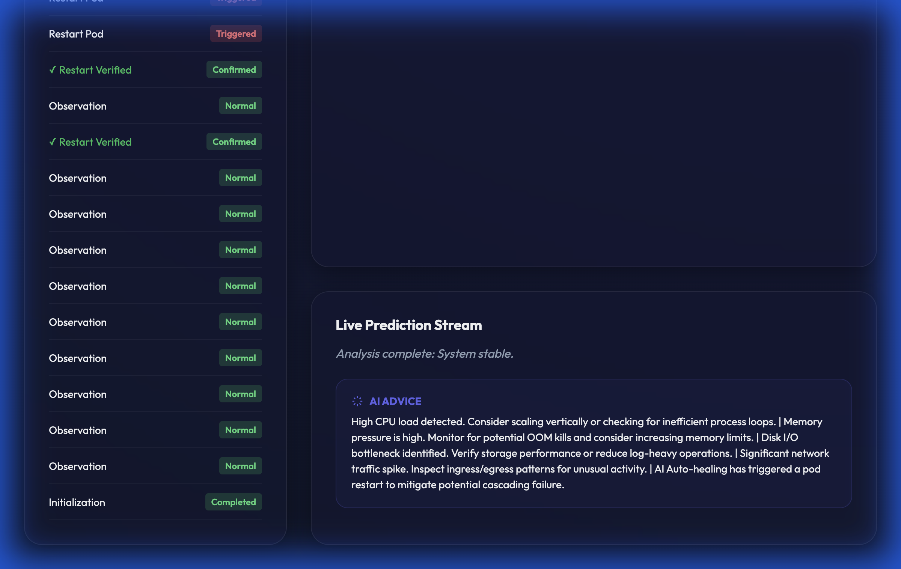
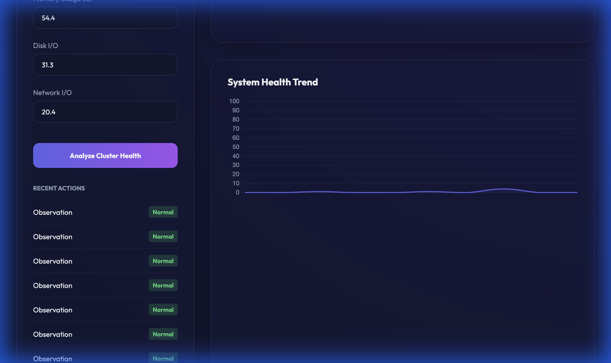
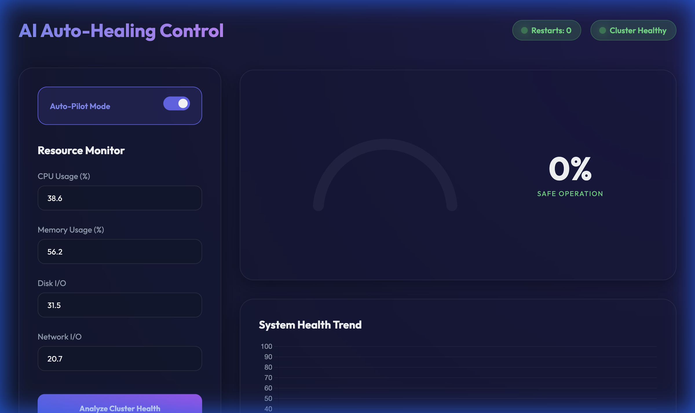
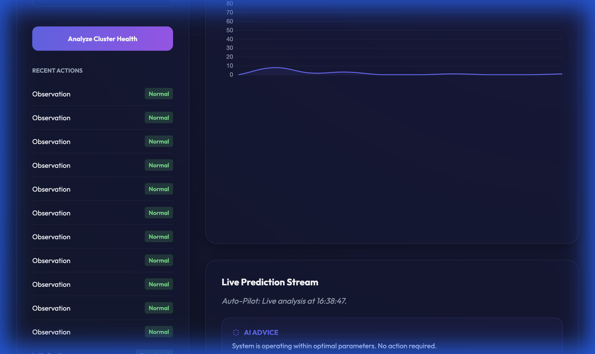

# K8S-FAILURE-PREDICTION 🚀
### Industry-Level AI Auto-Healing System for Kubernetes Clusters

This project predicts Kubernetes failures based on real-time resource usage metrics using *Machine Learning (Isolation Forest/Random Forest)*. It features a premium, self-healing dashboard that not only predicts failures but also takes automated action to stabilize the cluster.

---

## ✨ Key Features

- **🧠 AI-Powered Prediction**: Detects anomalies and predicts potential pod failures with high accuracy.
- **🛡️ Auto-Healing Logic**: Automated pod restarts and HPA scaling triggered by AI risk assessment.
- **📊 Real-time Dashboard**: A premium, glassmorphic UI for monitoring cluster health and risk trends.
- **💡 Smart Recommendation Engine**: Provides human-readable advice based on resource usage patterns.
- **📈 Health History Chart**: Visualizes system risk trends to spot cascading failure patterns early.
- **🚨 Prometheus Integration**: Exports metrics for comprehensive observability and alerting.
- **🤖 Auto-Pilot Mode**: Zero-touch background monitoring and automatic health analysis.

---

## 🖼️ Project Demo
### 🚀 Comprehensive Walkthrough
The recording below demonstrates the full system lifecycle: Manual resource monitoring, AI-driven failure prediction, and the zero-touch **Auto-Pilot Mode** in action.



---

## 📂 Project Structure
```text
k8s-failure-prediction/
├── 📁 src/                # Source code (FastAPI, ML model, Logic)
│   ├── api.py            # REST API with History & Recommendations
│   ├── auto_healing.py   # Self-Healing & Scaling Logic
│   ├── recommendations.py # AI Advice Generation
│   └── 📁 static/        # Glassmorphic Dashboard (HTML/JS)
├── 📁 models/             # Trained model (model.pkl)
├── 📁 data/               # Training Datasets
├── 📁 k8s/                # Kubernetes Deployment Manifests
├── requirements.txt      # Dependencies
├── DEPLOYMENT.md         # Detailed Deployment Guide
└── README.md             # Project Overview
```

---

## 🛠️ Installation & Setup

> [!TIP]
> For detailed deployment options (Docker, Kubernetes, Cloud), please refer to the **[Deployment Guide](./DEPLOYMENT.md)**.

### Step 1: Clone the Repository
```bash
git clone https://github.com/Akshaya0026/k8s-failure-prediction.git
cd k8s-failure-prediction
```

### Step 2: Set Up Environment
```bash
python -m venv venv
source venv/bin/activate  # Mac/Linux
pip install -r requirements.txt
```

### Step 3: Run the System
```bash
uvicorn src.api:app --reload --port 8000
```

---

| Safe Operation (Healthy) | Warning: Scaling Triggered | Critical: Auto-Healing |
| :---: | :---: | :---: |
|  |  |  |

| Health Trend Tracking | Auto-Pilot Monitor | Action History |
| :---: | :---: | :---: |
|  |  |  |

---

## 🧪 Testing the API
1. Open: `http://127.0.0.1:8000` to access the Dashboard.
2. API Documentation: `http://127.0.0.1:8000/docs`
3. Try the `/predict/` endpoint with high resource values to trigger auto-healing!
