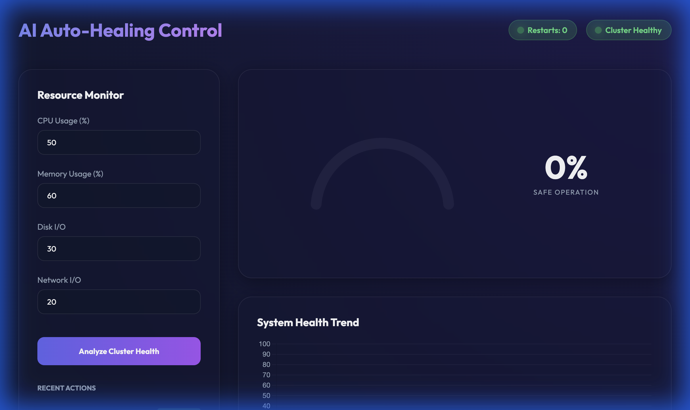
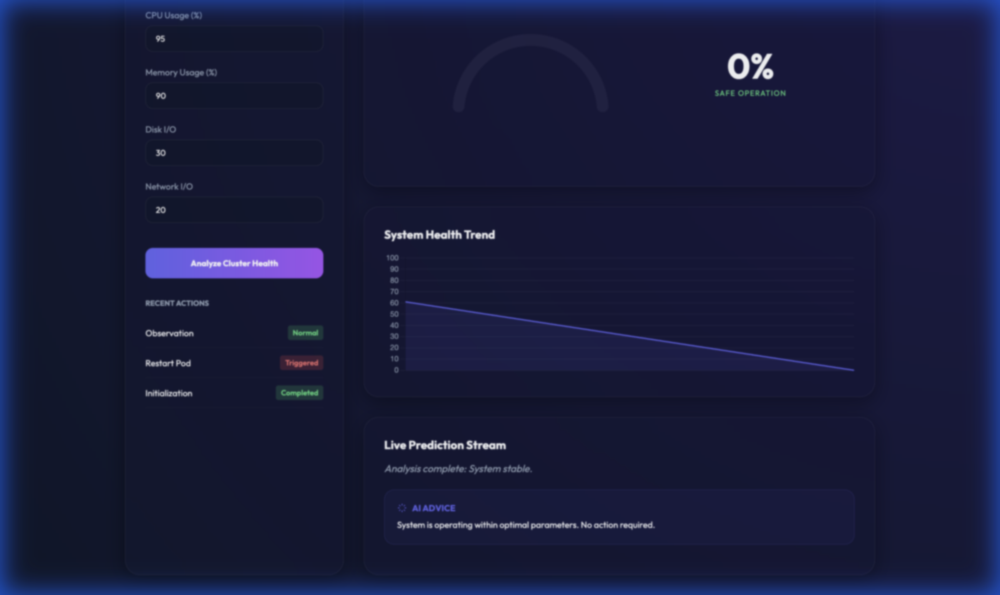

<<<<<<< HEAD
# PREDICTIVE AUTO-HEALING SYSTEM 🚀
### Industry-Level AI Sentinel for Kubernetes Clusters

This project predicts Kubernetes failures based on real-time resource usage metrics using *Machine Learning (Isolation Forest/Random Forest)*. It features a premium, self-healing dashboard that not only predicts failures but also takes automated action to stabilize the cluster.

---

## ✨ Key Features

- **🧠 AI-Powered Prediction**: Detects anomalies and predicts potential pod failures with high accuracy.
- **🛡️ Auto-Healing Logic**: Automated pod restarts and HPA scaling triggered by AI risk assessment.
- **📊 Real-time Dashboard**: A premium, glassmorphic UI for monitoring cluster health and risk trends.
- **💡 Smart Recommendation Engine**: Provides human-readable advice based on resource usage patterns (CPU load, memory pressure, etc.).
- **📈 Health History Chart**: Visualizes system risk trends to spot cascading failure patterns early.
- **🚨 Prometheus Integration**: Exports metrics for comprehensive observability and alerting.

---

## 📂 Project Structure
```text
k8s-failure-prediction/
├── 📁 src/                # Source code (FastAPI, ML model, Logic)
│   ├── api.py            # REST API with History & Recommendations
│   ├── auto_healing.py   # Self-Healing & Scaling Logic
│   ├── recommendations.py # AI Advice Generation
│   ├── model.py          # ML Model training & prediction
│   └── 📁 static/        # Glassmorphic Dashboard (HTML/JS)
├── 📁 models/             # Trained model (model.pkl)
├── 📁 data/               # Training Datasets
├── 📁 docs/               # Detailed Documentation
├── requirements.txt      # Dependencies
└── README.md             # Project Overview
```

---

## 🛠️ Installation & Setup

> [!TIP]
> For detailed deployment options (Docker, Kubernetes, Cloud), please refer to the **[Deployment Guide](./DEPLOYMENT.md)**.

### Step 1: Clone the Repository
```bash
git clone https://github.com/YOUR_USERNAME/k8s-failure-prediction.git
cd k8s-failure-prediction
```

### Step 2: Set Up Environment
```bash
python -m venv venv
source venv/bin/activate  # Mac/Linux
venv\Scripts\activate     # Windows
pip install -r requirements.txt
```

### Step 3: Run the System
```bash
python src/main.py
# Or directly with Uvicorn
uvicorn src.api:app --reload
```

---

## 🖥️ Enhanced AI Dashboard

The new dashboard provides a unified view of cluster health:
1. **Resource Monitor**: Manual or live input for system parameters.
2. **Risk Gauge**: Real-time AI risk assessment (Safe, Warning, Critical).
3. **Health Trend**: Historical tracking of risk levels.
4. **AI ADVICE**: Contextual recommendations for cluster optimization.

---

## 🖼️ Screenshots & Demo

### Video Walkthrough
Experience the full auto-healing flow from failure detection to stabilization.


### UI Gallery
| Initial State (Healthy) | Analysis & Recommendation |
| :---: | :---: |
|  |  |

---

## 🧪 Testing the API
1. Open: `http://127.0.0.1:8000` to access the Dashboard.
2. API Documentation: `http://127.0.0.1:8000/docs`
3. Try the `/predict/` endpoint with high resource values to trigger auto-healing!
=======
 k8s-failure-prediction
AI model for predicting failures in kubernetes clusters
 Kubernetes Failure Prediction using Machine Learning

 Overview
This project predicts Kubernetes failures based on real-time resource usage metrics.  
It uses *Machine Learning (Isolation Forest)* and provides predictions via a *FastAPI REST API*.

 📂 Project Structure
 k8s-failure-prediction/ 📁 src/ # Source code (FastAPI, ML model) 📁 models/ # Trained model (model.pkl) 📁 data/ # Dataset (k8s_metrics.csv) 📁 docs/ # Documentation (API guide, setup) 📁 presentation/ # Slides  📄 requirements.txt # Dependencies 📄 README.md # Project Overview

Installation & Setup
Step 1: Clone the Repository
git clone https://github.com/YOUR_USERNAME/k8s-failure-prediction.git
cd k8s-failure-prediction 

Step 2: Create a Virtual Environment
python -m venv k8s-env
k8s-env\Scripts\activate  # Windows
source k8s-env/bin/activate  # Mac/Linux

Step 3: Install Dependencies
pip install -r requirements.txt

Step 4: Run the FastAPI Server
python src/k8s_failure_prediction.py

Step 5: Test the API
Open: http://127.0.0.1:8000/docs

Test the /predict/ endpoint.
>>>>>>> a292a4cf2cc5dec749813ddd70a49d90d04fde3e
